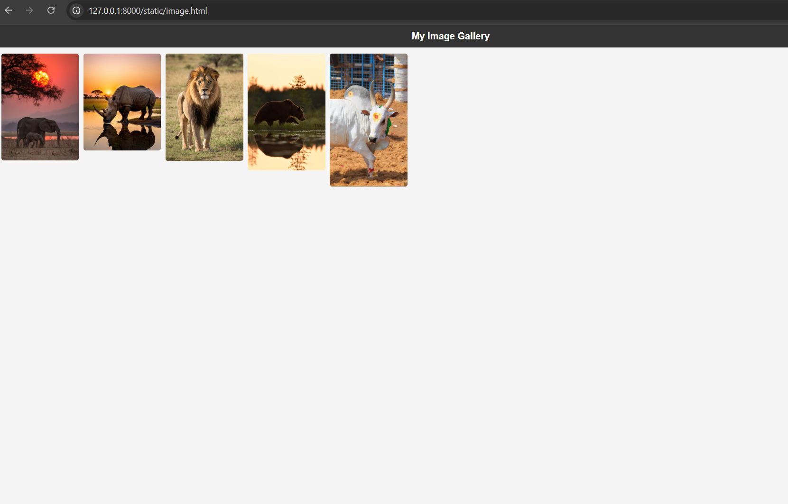
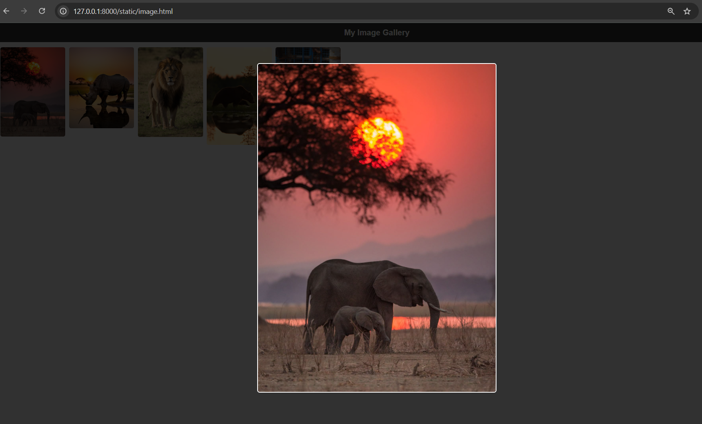
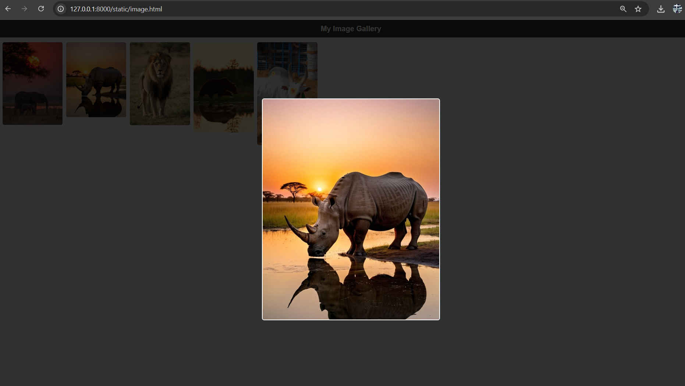
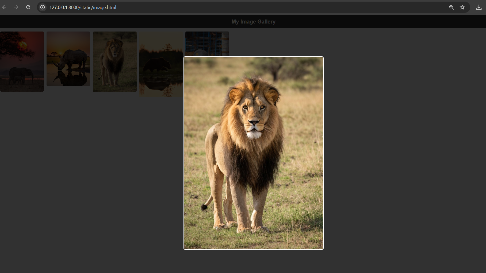
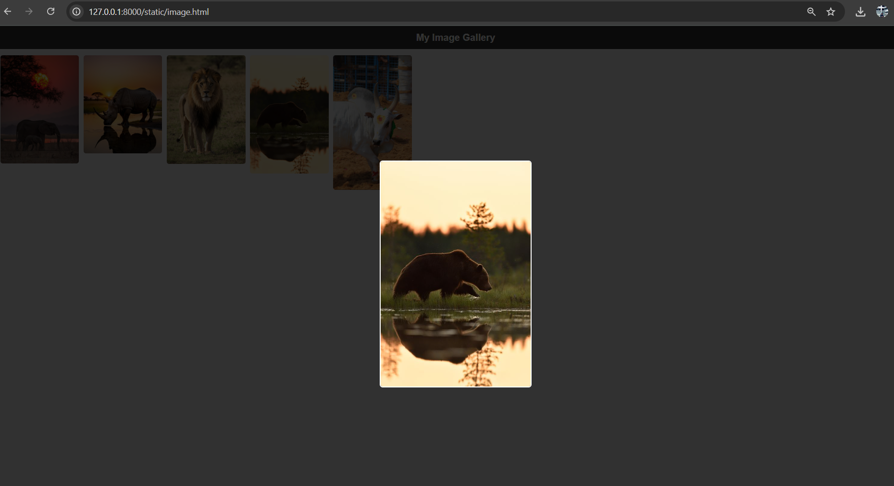
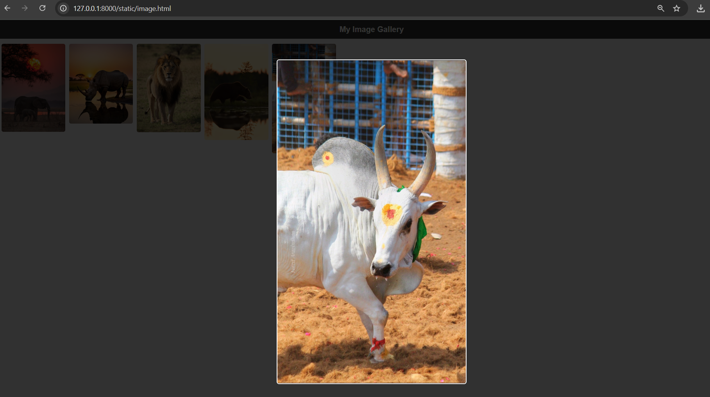

# Ex.08 Design of Interactive Image Gallery

## AIM
  To design a web application for an inteactive image gallery with minimum five images.

## DESIGN STEPS

## Step 1:

Clone the github repository and create Django admin interface

## Step 2:

Change settings.py file to allow request from all hosts.

## Step 3:

Use CSS for positioning and styling.

## Step 4:

Write JavaScript program for implementing interactivit

## Step 5:

Validate the HTML and CSS code

## Step 6:

Publish the website in the given URL.

## PROGRAM

```
<!DOCTYPE html>
<html lang="en">
<head>
  <meta charset="UTF-8">
  <meta name="viewport" content="width=device-width, initial-scale=1.0">
  <title>Image Gallery</title>
  <style>
    body {
      font-family: Arial, sans-serif;
      margin: 0;
      padding: 0;
      background: #f4f4f4;
    }
    h1 {
      text-align: center;
      padding: 20px;
      background: #333;
      color: #fff;
      margin: 0;
    }
    .gallery {
      display: grid;
      grid-template-columns: repeat(auto-fill, minmax(250px, 1fr));
      gap: 15px;
      padding: 20px;
    }
    .gallery img {
      width: 100%;
      height: auto;
      border-radius: 8px;
      cursor: pointer;
      transition: transform 0.3s ease;
    }
    .gallery img:hover {
      transform: scale(1.05);
    }
    /* Lightbox */
    .lightbox {
      position: fixed;
      top: 0; left: 0;
      width: 100%; height: 100%;
      background: rgba(0,0,0,0.8);
      display: none;
      justify-content: center;
      align-items: center;
    }
    .lightbox img {
      max-width: 90%;
      max-height: 80%;
      border: 4px solid #fff;
      border-radius: 10px;
    }
    .lightbox:active, .lightbox.show {
      display: flex;
    }
  </style>
</head>
<body>
  <h1>My Image Gallery</h1>
  <div class="gallery">
    
    
    
    
    
  </div>

  <!-- Lightbox -->
  <div class="lightbox" id="lightbox">
    
  </div>

  <script>
    const galleryImages = document.querySelectorAll('.gallery img');
    const lightbox = document.getElementById('lightbox');
    const lightboxImg = lightbox.querySelector('img');

    galleryImages.forEach(img => {
      img.addEventListener('click', () => {
        lightbox.classList.add('show');
        lightboxImg.src = img.src;
      });
    });

    lightbox.addEventListener('click', () => {
      lightbox.classList.remove('show');
    });
  </script>
</body>
</html>

```


## OUTPUT













## RESULT
  The program for designing an interactive image gallery using HTML, CSS and JavaScript is executed successfully.
